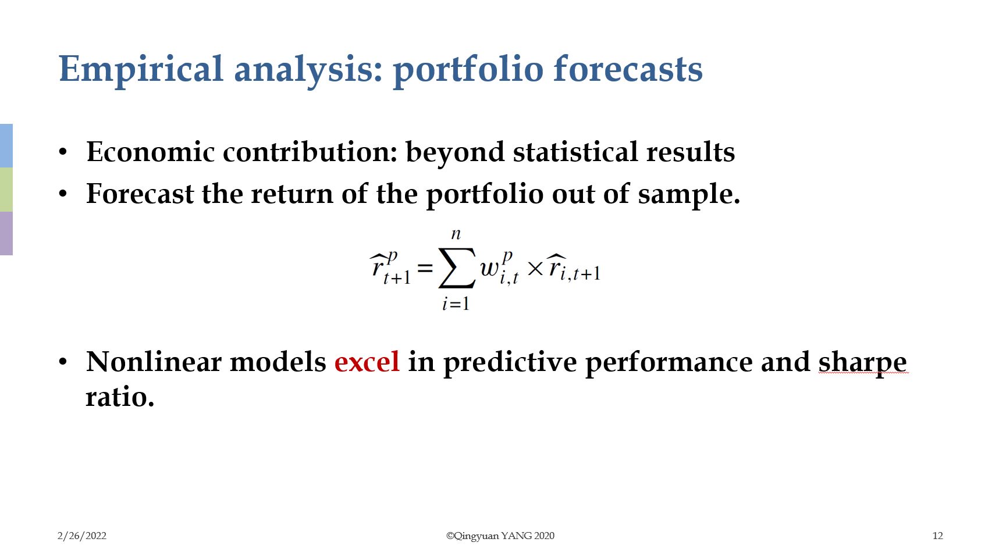

# Article Reproduce: Emperical Asset Pricing via Machine Learning, RFS 2020

author@Qingyuan Yang

 2020.11.8 updated

RFS2020年论文Emperical asset pricing via machine learning复现

- 代码demo是论文《Empirical asset pricing via machine learning》实证部分的模仿，数据部分换为中证500成分股（成分股会出现变动， 每月重新选取一次成分股，例：2010年初的500只大概率与2020年初的500只存在差异）2010年1月至2020年9月30日的月度收益率数据 和两个月度firm characteristics——size和book-to-market ratio，如压缩包中csv所示。
- 运行代码时，只需更改monthly return dataframe和monthly characteristics dataframe（如charactistics数据是季度数据或年度数据，则 补齐缺失值，用前值填充；如存在forward-looking bias，需要进行滞后操作），用代码读取新的csv文件，在初始化class时，用新的chardf 和retdf赋值即可。
- empirical asset pricing via machine learning 原文见pdf，presentation见ppt（推荐看原文，毕竟ppt只是我的浅薄理解）。
- 需要构建的characteristics见appendix *.pdf，Table A.6。
- 宏观因子构建方式详见 【宏观因子构建】*.pdf。

